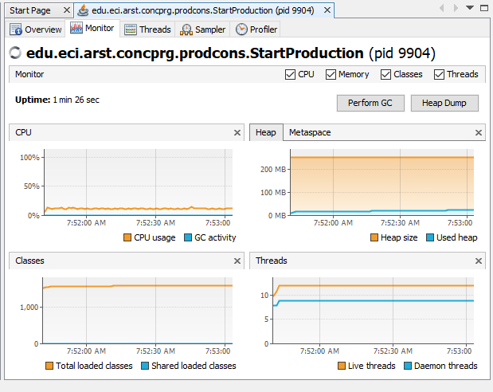
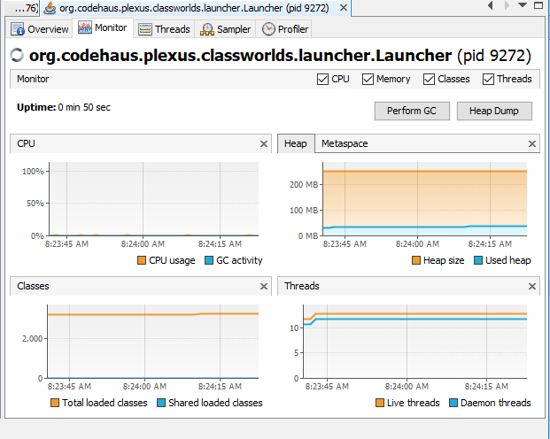
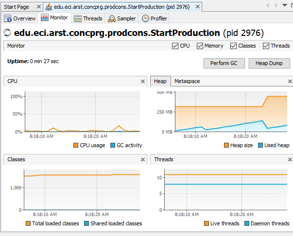

# lab4 
## *Part I:*
1.cpu consumption

* 1.1 What is the reason of this CPU consumption?because the class producer, in the moment to it execute the method run(), the code dont block the thread.
* 1.2 What is the class responsable of that consumption? The class responsable is producer.

2.

3.

## *Part II:*

## *Part III:*

